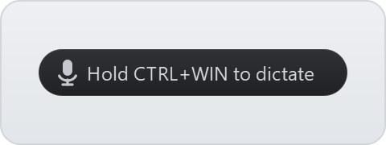
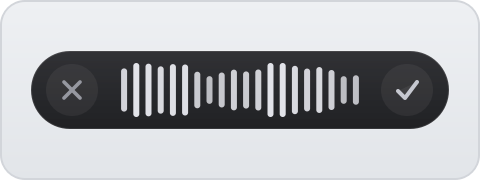
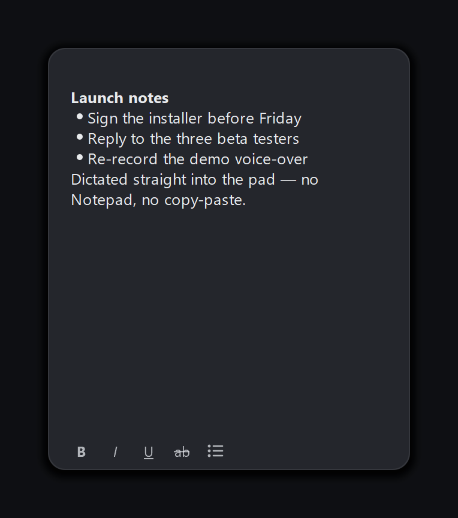
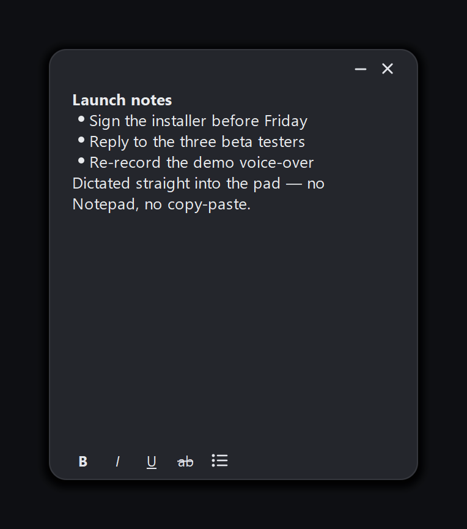
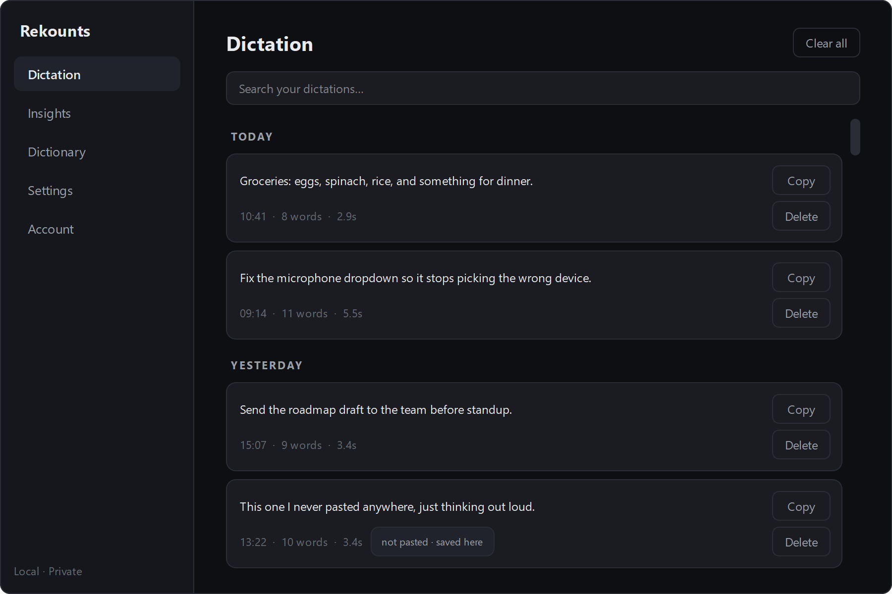
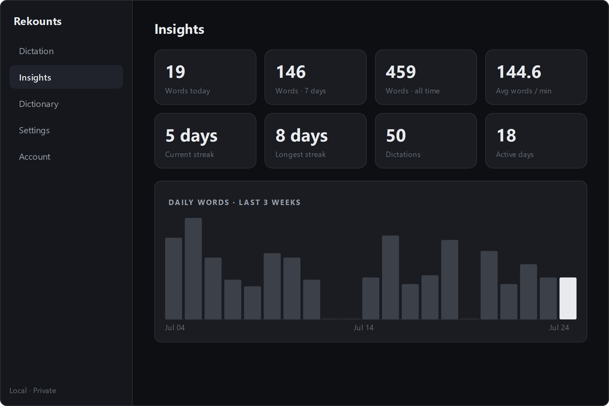
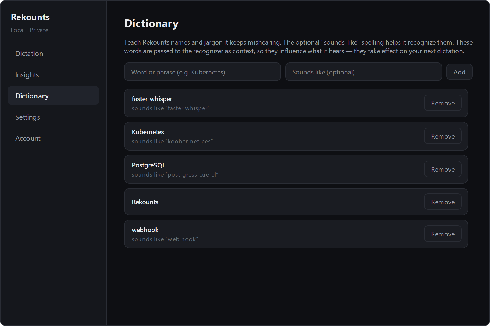
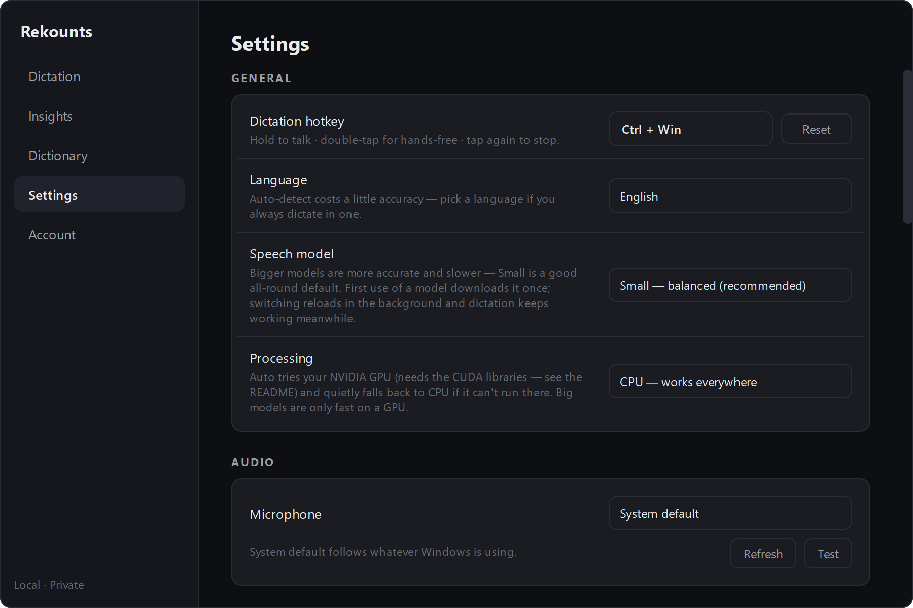

# Rekounts

[](https://github.com/rekreatedigital/rekounts/actions/workflows/tests.yml)
[](LICENSE)
[](https://www.python.org/downloads/)

Local voice dictation for Windows — a Wispr Flow–style daily driver. Hold a
hotkey, speak, and cleaned-up text is typed into whatever app you are using.
Your voice never leaves your machine.

> **Windows 10/11 only** for now — there is no macOS or Linux version yet.
> macOS is planned.

- **One hotkey**: hold `Ctrl+Win` to talk, double-tap it to go hands-free.
- **Local speech**: faster-whisper runs on your own CPU. No account, no cloud.
- **A local Hub**: everything you dictate is searchable, with word counts,
  streaks and a personal dictionary — all in a SQLite file on your disk.
- **Free software**: GPL-3.0.

The whole on-screen footprint while you dictate is one small monochrome pill:

| | |
|:---:|:---:|
|  |  |
| *Idle — barely there* | *Hover — it tells you the hotkey* |
|  |  |
| *Recording — ✕ · live waveform · ✓* | *Processing — about to type* |

See the [privacy page](docs/privacy.md) for exactly what is stored and the only
moments the app touches the network, and the
[changelog](CHANGELOG.md) for what changed.

## Install — the easy way (no Python)

1. Download **`Rekounts-Setup-<version>.exe`** from the
   [latest release](https://github.com/rekreatedigital/rekounts/releases/latest)
   and run it.
2. **Windows will probably warn you.** You will see *"Windows protected your PC"*
   — click **More info**, then **Run anyway**. This happens because the installer
   is not code-signed (a signing certificate costs money; it is a future
   decision), not because anything is wrong with it. You only have to do this
   once.
3. Click through: the GPL-3.0 licence, where to install it, and two optional
   boxes — a desktop shortcut, and whether to start Rekounts when you sign in.
   Both are off unless you tick them, and you can change your mind later in
   Settings.
4. The **first launch is slow** — a minute or two while it downloads the speech
   model (~486 MB for the default `small`) once, from this project's own release
   host. After that it starts in a few seconds and works with the network
   unplugged. Nothing is downloaded from Hugging Face — see
   [Where the speech models come from](#where-the-speech-models-come-from).
5. Look for the **Rekounts tray icon** near the clock (you may need to click
   the `^` to show hidden icons). A small dark **pill** also appears just above
   your taskbar — that is how you know it is listening. It fades to a faint hint
   when idle and brightens when you hover it.

**No administrator rights, no UAC prompt.** It installs for your account only,
into `%LOCALAPPDATA%\Programs\Rekounts`, and appears in **Settings → Apps** like
any other program.

**Upgrading** is the same download — run the newer installer over the old one.
It will ask you to close Rekounts if it is running, and it never touches your
settings, history or downloaded model.

**Uninstalling** leaves your data alone by default. `%APPDATA%\Rekounts` — your
settings, your dictation history and the speech model you downloaded — is only
deleted if you tick the box on the uninstaller that says so.

### Or the portable ZIP

Prefer not to install anything? Download **`Rekounts-<version>-win64.zip`** from
the same release page, unzip it **anywhere you like**, and run `Rekounts.exe`
from inside the folder. Keep the folder together — the `.exe` needs the files
next to it. Everything works the same; you just manage the folder yourself, and
there is no Start-menu entry and no uninstaller.

To have it start with Windows, see [Run on startup](#run-on-startup) below.

## Install — from source (developers)

You need **Python 3.11+** from https://www.python.org/downloads/ (tick
"Add Python to PATH" during install).

```bat
setup.bat    :: creates .venv and installs everything (~1 GB, one time)
run.bat      :: starts the app
```

Or by hand:

```bat
python -m venv .venv
.venv\Scripts\python -m pip install -r requirements.txt
.venv\Scripts\python -m rekounts
```

> **If `python` opens the Microsoft Store** instead of running, turn off the
> alias: Settings → Apps → Advanced app settings → App execution aliases → turn
> OFF `python.exe` / `python3.exe`.

## How to dictate

One hotkey — **`Ctrl+Win`** by default — does everything:

| You do | What happens |
| --- | --- |
| **Hold** it, speak, **release** | Push-to-talk. Your text is inserted when you let go. |
| **Double-tap** it | Hands-free — it keeps recording while you talk. |
| **Tap** it while hands-free | Stops and inserts. |
| Tap once while idle | Nothing (it just reminds you how it works). |

While recording, the pill expands into **✕ │ waveform │ ✓** — click **✕** to
throw the recording away, or **✓** to finish it early. The idle pill is faint
until you hover it, then it brightens and tells you the current hotkey.

A hands-free recording you forget about stops itself after 10 minutes (you can
change this in Settings), and it warns you about 30 seconds before it does.

## The tray menu

Right-click the tray icon:

- **Open Dashboard** — the Hub (below).
- **Open Scratchpad** — the sticky note (below).
- **Settings…** — jumps straight to the Hub's Settings page.
- **Microphone** / **Language** — quick switches without opening Settings.
- **Check for Updates** — asks GitHub whether there is a newer **release** than
  the version you are running, and tells you either way. Click the notification
  to open the release page. Only when clicked, unless you switch on
  **Check for updates automatically** (Settings → System, off by default) — with
  that on, it also asks once per launch and stays silent unless there is
  actually something newer. Either way it downloads nothing and installs
  nothing; you decide.
- **Help** — opens this README in your browser.
- **Quit**.

## The Scratchpad

<p align="center">
  
  
  <br /><em>At rest, and with the pointer over it</em>
</p>

Sometimes you just want to dictate a note, and opening Notepad to catch it is a
step too many. **Open Scratchpad** from the tray gives you a floating note that
is already listening.

- **Dictation lands in the note while the note is focused.** Click into anything
  else and dictation goes there instead, exactly as it always has — it is the
  same rule you already know, and the pad is simply one more place your cursor
  can be. Nothing goes through the clipboard on the way, so whatever you had
  copied stays copied.
- **It is a real note, not a transcript.** Edit it, and format it with the strip
  along the bottom: **bold**, *italic*, underline, strikethrough and bullets.
  Dictated text arrives as plain text in whatever formatting the cursor is
  already in.
- **It remembers.** Your text, its size and its position are all still there
  next time you open it — and next time you start Rekounts.
- **Minimal by design.** No title bar; drag it by any empty part of the note,
  resize it from any edge. Close and minimize fade in only when your pointer is
  over it. Closing hides the note, it never deletes it.

Turn the whole feature off in **Settings → System → Scratchpad** and the tray
entry disappears. Your note is kept either way.

## The Hub

<p align="center">
  
  <br /><em>Dictation — everything you have said, grouped by day, searchable</em>
</p>

**Open Dashboard** gives you five pages, all local:

- **Dictation** — everything you have dictated, newest first, grouped by day,
  with a search box. Copy or delete a single entry, or **Clear all**.
- **Insights** — words today / last 7 days / all time, your average
  words-per-minute, current and longest daily streak, and a 21-day bar chart.
- **Dictionary** — add names and jargon it keeps mishearing, with an optional
  "sounds like" spelling. Words are fed to the recognizer as context, and
  "sounds like" mishearings are auto-corrected after transcription.
- **Settings** — a full page inside the Hub. Every change applies the moment
  you make it: no Save button, no restart.
- **Account** — a local display name and avatar, shown in the Hub sidebar.
  There is no sign-in and no server; this is cosmetic.

<p align="center">
  
  <br /><em>Insights — words, streaks, and the last three weeks</em>
</p>

<p align="center">
  
  <br /><em>Dictionary — the words it kept mishearing, taught once</em>
</p>

<p align="center">
  
  <br /><em>Settings — a page inside the Hub, applied the moment you change it</em>
</p>

> These four are generated by `tools/capture_hub_shots.py`, which renders the
> real window against a throwaway database of sample dictations — the history,
> the numbers and the streaks in them are made up, not anyone's.

## Settings

Settings are a page inside the Hub (tray → **Settings…** jumps straight there).
**Every change applies the moment you make it** — there is no Save button and
no restart. Switching the speech model reloads it in the background and tells
you when it is ready; everything else takes effect at once or on your next
dictation.

- **General** — the dictation hotkey (click the box and press the combo you
  want; combos the app cannot listen for are rejected rather than saved, and a
  **Reset** button puts it back to `Ctrl+Win`); language (Auto / English /
  Tagalog); the speech model — `small` (default, balanced, ~486 MB), `base`
  (fastest, ~148 MB), `medium` (most accurate offered, ~1.5 GB) — each size
  downloads once, the first time you pick it, from this project's own release
  host (see the **Accuracy guide** below for how to choose); and
  **Processing** — `CPU` (default) or `Auto`, which uses your NVIDIA GPU when
  it can actually run there and quietly falls back to CPU otherwise.
- **Audio** — microphone, with **Refresh** and a **Test** button (you want
  "Heard you clearly").
- **Behavior** — insertion mode: `paste` (default; your clipboard is preserved)
  or `keystroke` (types the characters; never touches the clipboard); live
  typing (experimental — see the warning below); the text cleanup toggles
  (remove fillers, auto-capitalize, fix punctuation spacing, remove repeated
  words and repeated short phrases — "I'm gonna I'm gonna" → "I'm gonna" — and
  **remove hedge phrases**, which drops "you know", "I mean", "like" and
  "right" only when commas mark them as asides, so "I like it" and "turn
  right" are never touched); the pre-roll buffer; the maximum recording
  length; and the phantom-phrase filter.
- **System** — launch at login, sound effects, the on-screen pill, and tray
  notifications.
- **Data & Privacy** — the dictation-history switch, **Clear all**, and an
  **Open folder** shortcut to where your data lives.

Only a few tuning knobs remain config-file-only — edit
`%APPDATA%\Rekounts\config.json` and relaunch: `beam_size` (transcription
beam width), `stream_model` (the model live typing uses) and
`preroll_seconds`.

> **Live typing** types words as you speak instead of once at the end. It is
> **off by default and still unreliable**: Whisper re-transcribes the growing
> audio buffer and rewrites earlier words, which produces doubled or garbled
> text. Leave it off for accurate dictation. If you turn it on, use a
> non-modifier hotkey like `F8` — holding Ctrl/Win while it types would fire
> shortcuts.

## Troubleshooting

- **Nothing gets typed:** Settings → **Test** your mic. "Silent" means wrong
  microphone or muted in Windows.
- **"Another instance is already running"** in the log: it is already running —
  check the tray (and the hidden-icons `^` flyout).
- **The hotkey does nothing / clashes with another app:** change it in Settings.
- **The hotkey ignores you only while an "as administrator" window is focused:**
  Windows won't let a normal-privilege app see keystrokes aimed at an elevated
  window (the same UIPI rule that blocks typing *into* admin apps). Click a
  normal window and the hotkey works again; or run Rekounts as administrator
  too if you dictate into elevated apps a lot. (This is a Windows restriction,
  not a bug — the hotkey engine deliberately does not use `RegisterHotKey`, which
  can't do modifier-only combos like `Ctrl+Win` or push-to-talk at all.)
- **Text went nowhere in an admin app:** Windows forbids a normal app from
  typing into an elevated one. You will get a notice saying so; your text is
  still saved in the Hub, so you can copy it from there.
- **Tagalog accuracy is rough:** switch **Model** to `medium` and speak clearly.
- **Anything else:** `%APPDATA%\Rekounts\logs\rekounts.log`. To capture a
  detailed hotkey trace for a bug report, set the environment variable
  `REKOUNTS_LOG_LEVEL=DEBUG` before launching and reproduce the problem.

## Where your stuff lives

| What | Path |
| --- | --- |
| Settings | `%APPDATA%\Rekounts\config.json` |
| Dictation history + dictionary | `%APPDATA%\Rekounts\history.db` |
| Scratchpad note | `%APPDATA%\Rekounts\scratchpad.json` |
| Logs | `%APPDATA%\Rekounts\logs\rekounts.log` |
| Speech models | `%APPDATA%\Rekounts\models\<name>\` |
| The program itself (if you used the installer) | `%LOCALAPPDATA%\Programs\Rekounts` |

Note that those are two different places on purpose: **uninstalling removes the
program, not your data.** `%APPDATA%\Rekounts` survives uninstalls, reinstalls
and upgrades unless you tick the uninstaller's "also delete my settings,
history and downloaded model" box.

Full detail — including what is *not* stored — is in
[docs/privacy.md](docs/privacy.md).

### Upgrading from TalkativeAI

TalkativeAI was this app's placeholder name. If you used it, **you do not have to
do anything** — the first launch of Rekounts brings your settings, history,
dictionary and downloaded models across from `%APPDATA%\TalkativeAI`, and moves
your **Launch at login** entry to the new name.

Quit the old app first if it is still in your system tray: both versions listen
for the same hotkey, so Rekounts refuses to start alongside it and tells you to
close it. Your old `%APPDATA%\TalkativeAI` folder is left behind on purpose so
you can roll back; delete it whenever you are happy.

## Where the speech models come from

The speech models are downloaded from **this project's own release host**:

```
https://github.com/rekreatedigital/rekounts-models
```

The app **never contacts `huggingface.co`** — not on first run, not ever. That is
structural rather than a setting: the model files are fetched up front and the
speech engine is handed a local directory path, so there is no code path left
that could reach out for anything.

| Model | Download | Notes |
| --- | --- | --- |
| `base` | ~148 MB | Fastest on any CPU. |
| `small` | ~486 MB | Noticeably better on accented or natural speech. |
| `medium` | ~1.5 GB | Most accurate, clearly slower on CPU. |

Each download is verified against a SHA256 hash recorded in
[`rekounts/models.py`](rekounts/models.py) before it is used, so a corrupted
or tampered file is rejected instead of run. Interrupted downloads resume rather
than starting over.

**Already have the model?** If a matching copy exists in your
`%USERPROFILE%\.cache\huggingface` cache from another tool, Rekounts copies it
into its own folder on first run and downloads nothing at all. Your cache is left
untouched.

The models are SYSTRAN's MIT-licensed CTranslate2 conversions of OpenAI's
MIT-licensed Whisper models, redistributed unmodified — see
[docs/model-license.md](docs/model-license.md) for the attribution and license
notices, and for how to add another model.

## Run on startup

Flip **Launch at login** in Settings → System. The app adds a per-user entry
under `HKCU\...\CurrentVersion\Run` and re-checks it at every launch, so it
fixes itself if you move the app folder. (Turning the switch off removes the
entry.) Alternatively, drop a shortcut to `Rekounts.exe` or `run.bat` into
`shell:startup` (Win+R → `shell:startup`).

The installer's **"Start Rekounts automatically when I sign in to Windows"**
checkbox is the *same* switch, not a second one — it writes the same registry
entry, so the Settings toggle reads back ON afterwards and turning it off in
either place turns it off everywhere. If you have it on already, re-running the
installer leaves it on.

## Accuracy guide

Accuracy comes from two things you can change here: the **model** (the engine)
and, if you have one, a **GPU**. This is deliberately a *local* app — no cloud,
no account — so it can't match a huge server model, but a good local setup gets
close for everyday dictation.

**Picking a model.** Bigger models mishear fewer words, especially on accents,
names and fast or mumbled speech — but they're much slower on a CPU. Processing
time below is a fraction of the clip length — so 0.20× means a 10-second
dictation is ready in ~2 seconds. Measured on a fast CPU (AMD Ryzen 7 7800X3D,
int8); **older machines will be proportionally slower**, so the ranking matters
more than the absolute numbers:

| Model | Relative speed (CPU) | Good for |
| --- | --- | --- |
| `base` | ~0.09× (fastest) | old/weak machines, quick notes |
| `small` | ~0.20× (**default**) | the everyday sweet spot on CPU |
| `medium` | ~0.6–0.7× | more accuracy when you'll wait a beat |
| `distil-large-v3` | ~0.8× CPU | near top accuracy, better on a GPU |
| `large-v3-turbo` | ~0.8× CPU | best accuracy — really wants a GPU |

On CPU, `medium` and the large models take several seconds per dictation; they
shine on a GPU. `small` is the default because it's a clear accuracy step up
from `base` while still feeling instant on CPU.

> **Measure it on your own voice.** Whisper's own numbers rank the models, but
> the only ranking that matters is on *your* accent and *your* mic. `tools/
> asr_bench.py` does exactly that: record ~10 short clips, write down what you
> said, and it reports word error rate and speed per model. Nothing you record
> leaves your machine or enters git. See the header of that file for the steps.

**Using a GPU (optional) — this is the big win.** An NVIDIA GPU doesn't just
make the big models usable, it makes them *faster than `small` on CPU*. Measured
on an RTX 5070 Ti (16 GB, `int8_float16`), same clips as above:

| Model | GPU | CPU | Speed-up |
| --- | --- | --- | --- |
| `small` | ~0.06× | ~0.20× | ~3.5× |
| `medium` | ~0.08× | ~0.6–0.7× | ~7× |
| `distil-large-v3` | ~0.04× | ~0.73× | ~18× |
| `large-v3-turbo` | ~0.04× | ~0.72× | ~16× |

(Figures vary ~10–15% run to run depending on GPU clocks; the ranking is stable.)

Note the shape of that table: on a GPU, **`large-v3-turbo` is both the most
accurate option and among the fastest** (turbo and distil have far fewer decoder
layers than `large-v3`). So if you have a working NVIDIA GPU, there's little
reason not to run `large-v3-turbo`.

> **Availability note:** the in-app Model list currently offers `base`, `small`
> and `medium`. The two large models are benchmarked here but not yet published
> to the app's release host — they'll appear in the dropdown the moment they
> are. Until then `tools/asr_bench.py` can still run them for measurement.

To turn it on, set **Processing → Auto** in Settings. Auto probes whether the
GPU can *actually transcribe* — not just load a model, since a missing CUDA
library only fails on the first real use — and silently falls back to CPU if it
can't, so it's always safe to leave on. (The packaged `.exe` is a deliberately
CPU-only build, so Auto simply stays on CPU there; GPU needs a from-source
install.)

GPU needs the CUDA runtime libraries installed in the same environment. All
three of these are required (cuBLAS depends on cudart, so leaving it out gives a
confusing `cublas64_12.dll is not found`):

```
pip install nvidia-cublas-cu12 nvidia-cudnn-cu12 nvidia-cuda-runtime-cu12
```

Without them, Auto simply stays on CPU — they are **not** a required dependency
of the app. Verified working on an RTX 50-series (Blackwell, `sm_120`) card with
ctranslate2 4.8.1 and a CUDA 13 driver; the CUDA-12 wheels are correct even on a
CUDA-13 driver. Power users can force `"device": "cuda"` in `config.json`, but
`Auto` is the safe choice.

**Mic matters as much as the model.** The model only ever hears what your mic
captures. A close, clean mic beats a distant laptop mic more than one model size
does. Use Settings → **Test** to confirm "Heard you clearly". Heavy virtual-mic
processing (noise suppression, "AI" voice effects) can smear the audio the model
sees — if accuracy is poor, try your plain hardware mic.

**What the Dictionary is (and isn't).** The Dictionary in the Hub is
*personalization*, not the accuracy engine. It biases recognition toward names
and jargon you add (your app's product names, colleagues' names, acronyms) so
the model spells them your way. It won't fix general mishearing — that's the
model's job. Use it for the handful of words it keeps getting wrong.

**Coming later.** A local AI cleanup pass (grammar/punctuation polish, all
on-device) is planned to close more of the gap to cloud tools — separate from
this raw-accuracy work.

## CPU vs GPU

Transcription runs on **CPU by default**, which is fast enough for dictation
with the `small` model on a modern machine. To use an NVIDIA GPU, set
**Processing → Auto** in Settings (or `"device": "auto"` in `config.json`) — see
the **Accuracy guide** above for what the GPU needs and how the safe fallback
works.

## Building the standalone app

```bat
build.bat
```

One run produces everything a release needs, in `dist\`:

| | |
| --- | --- |
| `Rekounts\Rekounts.exe` | the app (~350 MB — it bundles Python, Qt and the speech engine) |
| `Rekounts-<version>-win64.zip` | the portable download |
| `Rekounts-Setup-<version>.exe` | the installer |

The speech model is *not* bundled; it downloads once on first run from this
project's own release host (see
[Where the speech models come from](#where-the-speech-models-come-from)).

The installer step needs **Inno Setup 6.3 or newer**, a build-time dependency
only — nothing in the app uses it:

```bat
winget install -e --id JRSoftware.InnoSetup
```

Without it, `build.bat` still builds the app and the ZIP, says the installer was
skipped, and exits successfully. `build.bat --no-installer` skips it deliberately.
The installer script itself is [installer/rekounts.iss](installer/rekounts.iss);
its header explains the three guarantees it exists to keep (no admin, your data
survives an uninstall, one launch-at-login mechanism).

### The icon

`assets/icon.ico` is committed, but generated — regenerate it (and the
installer's wizard bitmaps) with:

```bat
.venv\Scripts\python tools\make_icon.py
```

The mark is the site favicon transcribed into that script, which is the icon's
source of record. The same `.ico` is used by the `.exe`, the tray, the app's
windows, the installer and the Start-menu shortcut.

### Publishing a speech model (maintainers)

Model files are release assets on a separate public repo, so downloads keep
working even while this repo is private. Adding or refreshing one is a single
command:

```bat
.venv\Scripts\python scripts\publish_models.py base      :: fetch, verify, upload
.venv\Scripts\python scripts\publish_models.py --all
.venv\Scripts\python scripts\publish_models.py turbo --hashes --upstream org/repo
```

It fetches the upstream files, checks their SHA256 against the manifest in
`rekounts/models.py` (refusing to publish on a mismatch), and uploads them
with the required license notices. `--hashes` prints the manifest entry for a
model you are adding; `--dry-run` does everything except upload.

## Development

```bat
.venv\Scripts\python -m pytest        :: 400+ unit tests
```

CI installs `requirements-test.txt` (a much smaller set than the runtime
`requirements.txt`) and runs the suite on Windows (Python 3.11 and 3.12) plus
`ruff check .`; both are quick enough to run locally the same way. The suite
also runs on Linux and macOS in CI — the app itself is Windows-only, but the
tests fake the Windows-specific pieces, and keeping them green off-Windows
protects the seam a future macOS port will use. Hardware- and UI-dependent
behavior is covered by
[docs/manual-smoke-test.md](docs/manual-smoke-test.md). See
[ARCHITECTURE.md](ARCHITECTURE.md) for the module map and data flow.

The version string lives in exactly one place, `rekounts/__init__.py`;
`pyproject.toml` and the `.exe`'s file properties both read it from there.

## License

Rekounts is free software under the **GNU General Public License v3.0** — you
can use it, read it, change it, and share it, as long as anything you pass on
stays free under the same license. See [LICENSE](LICENSE) for the full text.

Copyright (C) 2026 Rekreate Digital.

## Contributing

Pull requests are welcome at
[github.com/rekreatedigital/rekounts](https://github.com/rekreatedigital/rekounts).
The short version: keep the tests green; contributions ship under GPL-3.0 with
a light CLA. See [CONTRIBUTING.md](CONTRIBUTING.md) for the (brief, friendly)
details, including the licensing terms.
